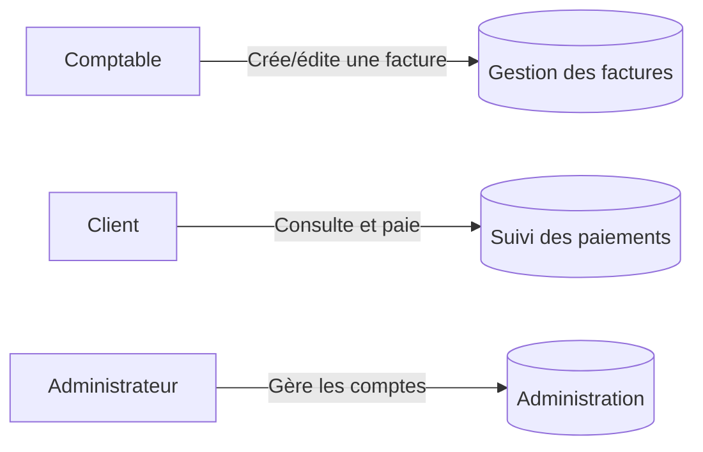

# Business Use Cases — Plateforme de facturation

## Use cases business

- **UCB-1** : Le comptable crée, modifie et supprime des factures.
- **UCB-2** : Le client consulte ses factures et effectue un paiement.
- **UCB-3** : L'administrateur gère les comptes utilisateurs.
