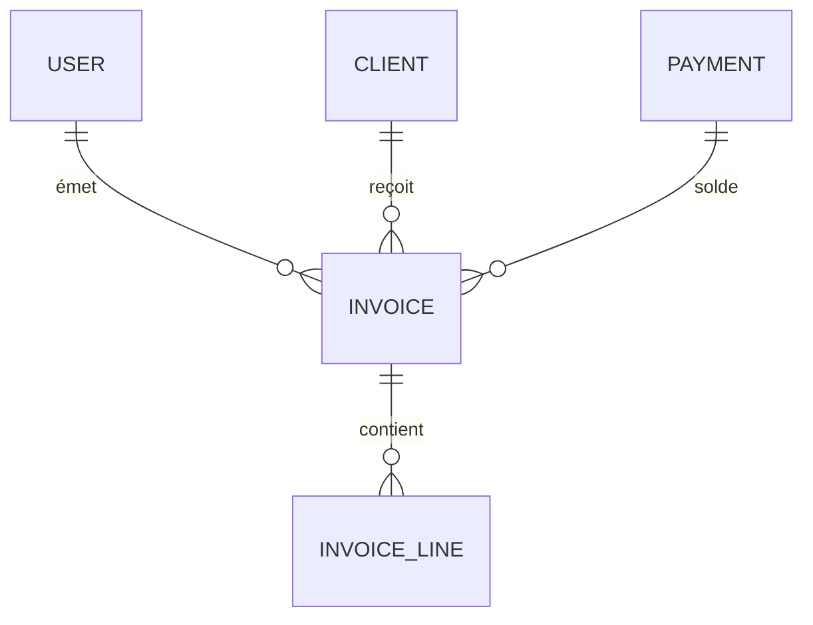

# Modèle entité-relation

## Entités

- **USER** : id, email, role
- **CLIENT** : id, raison_sociale, siret
- **INVOICE** : id, client_id, user_id, statut, montant_ht, tva, date_emission
- **INVOICE_LINE** : id, invoice_id, designation, quantite, prix_unitaire
- **PAYMENT** : id, invoice_id, montant, date, statut
