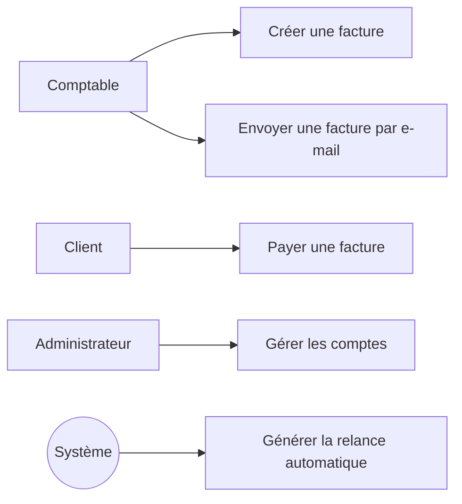

# System Use Cases — Plateforme de facturation

```mermaid
flowchart LR
    C[Comptable] --> U1[Créer une facture]
    C --> U2[Envoyer une facture par e-mail]
    Cl[Client] --> U3[Payer une facture]
    A[Administrateur] --> U4[Gérer les comptes]
    S((Système)) --> U5[Générer la relance automatique]
```

## Validation métier

- U1 : validé par le besoin comptable (contrôle des lignes).
- U5 : la relance automatique doit respecter les délais légaux.
