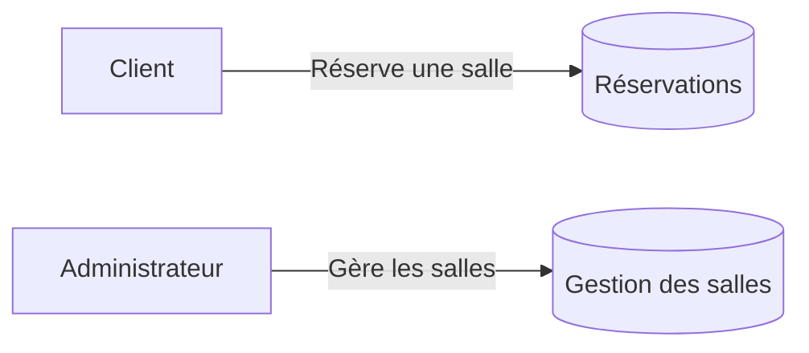

# Business Use Cases — Gestion des réservations

```mermaid
flowchart LR
    C[Client] -->|Réserve une salle| UCB1[(Réservations)]
    A[Administrateur] -->|Gère les salles| UCB2[(Gestion des salles)]
```

## Use cases business
- **UCB-1** : Le client réserve une salle.
- **UCB-2** : L'administrateur gère les salles.
