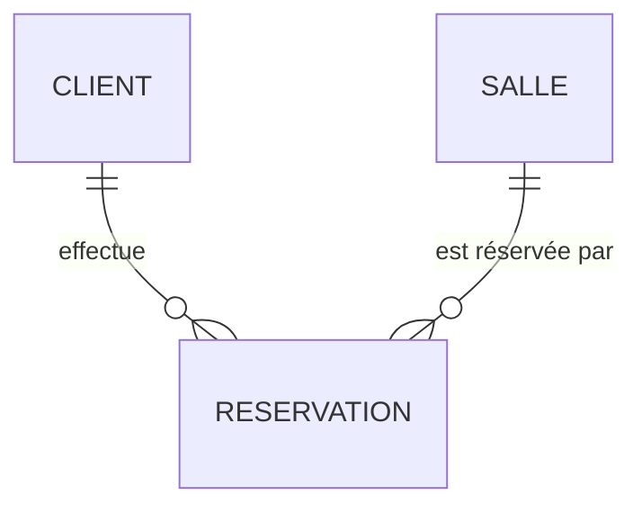

# Modèle entité-relation

```mermaid
erDiagram
    CLIENT ||--o{ RESERVATION : "effectue"
    SALLE ||--o{ RESERVATION : "est réservée par"
```

## Entités
- **CLIENT** : id, nom, email
- **SALLE** : id, nom, capacite
- **RESERVATION** : id, client_id, salle_id, date_debut, date_fin
