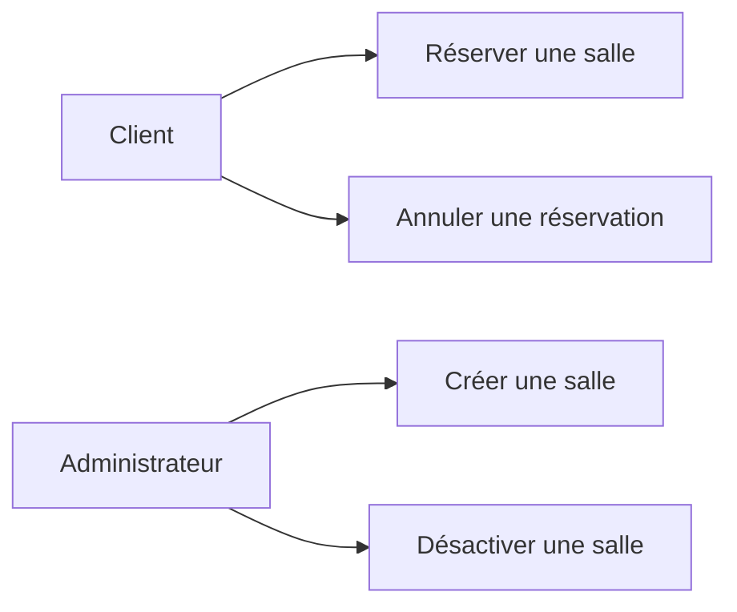

# System Use Cases

```mermaid
flowchart LR
    C[Client] --> U1[Réserver une salle]
    C --> U2[Annuler une réservation]
    A[Administrateur] --> U3[Créer une salle]
    A --> U4[Désactiver une salle]
```

## Validation métier
- U1 : une réservation ne peut pas chevaucher une réservation existante sur la même salle.
- U2 : l'annulation est possible jusqu'à 24 h avant.
